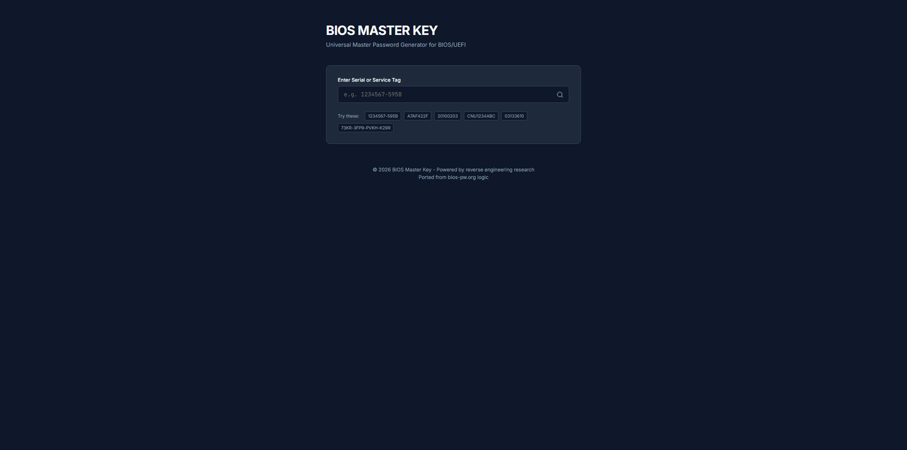

# BIOS Master Key



BIOS Master Key is a Universal Master Password Generator for BIOS/UEFI, ported from bios-pw.org logic.

## Features

- Generates unlock keys for various laptop manufacturers (Dell, HP, Asus, Acer, Sony, Samsung, etc.).
- Clean, responsive UI with quick copy functionality.
- Fast, local password computation directly in your browser.

## How to Run

1. Make sure you have Node.js installed.
2. Run `npm install` to install dependencies.
3. Run `npm run dev` to start the development server.
4. Open the displayed local URL in your browser.

## Building for Production

To build the static files for production, run:

```bash
npm run build
```

This will output the compiled assets into the `dist` directory.
